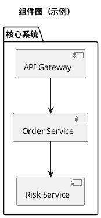

# PRD to 系分（SDD 方式）

## 目标

基于 PRD 和工程现状，产出一份可落地的系分文档。文档必须遵循模板结构，且设计过程必须先分析需求、再读取现状、再提供双方案让用户选择，最后继续细化。

## 输入

- `prd`（必填）：PRD 正文，或 PRD 文件路径
- `project_positioning`（可选）：工程定位、边界、上下游系统说明
- `template_path`（可选）：系分模板路径，默认 `templates/系分模版.md`（当前标准模板）
- `project_root`（可选）：工程根目录，默认当前工作目录
- `output_path`（可选）：输出文件路径；未指定时在会话中输出并建议文件名
- `historical_docs_dir`（可选）：历史 PRD/系分样本目录；未指定时优先使用当前工作目录

## 默认模板（当前系分模版）

- 若用户未指定 `template_path`，必须使用 `templates/系分模版.md`。
- 若用户指定了其它模板，按用户指定执行，但需提示“与默认模板差异”可能带来的评审影响。

## 输入解析规则（PRD 文本/文件）

1. 若 `prd` 像路径且文件存在，按文件读取；否则按内联文本处理。
2. 支持优先级：`.md`、`.txt`、可读文本文件。
3. 对 `.doc` / `.docx`：若无法可靠解析，不得臆造内容，要求用户转换为 `.md`/纯文本或直接粘贴。
4. 进入正式设计前，必须具备可解析 PRD；若信息不足，先提问补齐关键缺口。

## 历史样本对齐（先做再设计）

若目录内存在历史 PRD 与系分文档，必须先读取并对齐其写作风格、抽象粒度和系统切分方式。

优先识别以下映射关系（文件名可近似匹配）：

- `【PRD】微粒贷.md` -> `【lcs】微粒贷二期.md`、`【instloancore】微粒贷代偿后还款系分.md`
- `【PRD】费率计算器升级.md` -> `【lcs】【系分】费率计算器升级.md`

从历史样本提取：

- 系统边界切分法（如 `lcs`、`instloancore`）
- 常见改动点表达方式（接口、表结构、灰度开关、容差、回归）
- 图文风格与章节颗粒度

历史样本用于“风格和边界对齐”，不作为事实真相来源。与当前 PRD 冲突时，以当前 PRD + 工程现状为准。

## 领域特化启发式（基于历史样本）

### 微粒贷类 PRD（复杂多期、多系统）

- 默认按“期数 x 还款场景 x 系统边界”拆分。
- 重点关注：代偿后还款、部分还款、逾期/宽限期、跳期校验、容差策略。
- 若同时涉及 `lcs` 与 `instloancore`，默认输出 2 份系分（必要时再加总览）。
- 文档中必须单列“资方口径 vs 我方口径”的一致性与差异处理。

### 费率计算器类 PRD（规则/公式密集）

- 必须输出 `规则矩阵`，最少包含：`Xcap`、未来预估应收、未来预估抵扣、预估减免金额。
- 必须列出校验规则（如不允许跳期、还款时间顺序校验）与异常文案。
- 必须列出兼容字段和开关策略（如新旧 `calcRateType`、`extraInfo` 扩展字段、灰度开关）。
- 必须明确“历史逻辑回归范围”，避免新逻辑污染旧路径。

## 大 PRD 拆分协议（针对超长文档）

当 PRD 篇幅较大或包含多期（如 1/2/2.5/3 期）时，必须先拆分再设计：

0. 先做“分段读取”与“目录索引”，避免漏读关键约束或附录规则。
1. 按“业务场景/期数/系统边界”切片。
2. 形成 `需求切片映射表`，至少包含：
   - PRD 章节
   - 场景/能力点
   - 目标系统（如 `lcs`/`instloancore`）
   - 变更类型（复用/改造/新增）
   - 预计输出文档
3. 若映射到多个系统，默认生成“多份系分文档”，每份文档只覆盖其系统边界。
4. 在进入方案定稿前，先让用户确认映射表。

## 强制流程（SDD 分阶段）

按以下阶段执行，不得跳过关键门禁：

1. `SPEC`：需求分析（做什么、为什么）
2. `SPLIT`：大 PRD 切片与系统映射（单文档/多文档判定）
3. `CURRENT_STATE`：读取工程现状（现在是什么样）
4. `PLAN`：至少两个可选方案（A/B）并等待用户决策
5. `DOC`：按模板产出完整系分文档（支持多文档）
6. `REVIEW`：一致性检查与交付确认

---

## Phase 1 - SPEC（需求分析）

从 PRD 中提取并结构化：

- 业务目标与用户价值
- 范围（In/Out of Scope）
- 关键业务流程
- 功能需求与非功能需求
- 约束条件（技术、合规、性能、依赖）
- 验收标准

输出 `需求分析摘要`，并将不确定项标记为 `❓待确认`。阻塞性问题必须先向用户澄清。

## Phase 2 - SPLIT（切片与文档规划）

输出 `需求切片映射表` 与 `输出计划`：

| 切片ID | 场景/能力点 | 目标系统 | 变更类型 | 输出文档 |
| --- | --- | --- | --- | --- |
| S1 | 示例：代偿后还款 | instloancore | 新增 | `instloancore-xxx系分.md` |

规则：

- 单系统集中改造：可输出 1 份系分。
- 多系统边界清晰：输出 N 份系分（每系统 1 份），并补 1 份总览索引（可选）。
- 若用户要求“只出一份”，必须说明跨系统耦合风险与评审成本。

## Phase 3 - CURRENT_STATE（工程现状读取）

必须读取当前工程，确认已有能力后再设计。优先检查：

- 项目说明：`README`、`docs`、接口文档
- 关键模块：业务服务、领域模型、数据访问层
- 现有接口：路由、请求/响应模型、鉴权/验签规范
- 数据层：表结构、迁移脚本、实体关系
- 非功能：监控、日志、限流、任务调度、回归用例

输出 `现状能力清单`（建议表格）：

| 能力点 | 现状结论 | 证据（文件/模块） | 与 PRD 关系 |
| --- | --- | --- | --- |
| 示例：订单创建 | 已支持基础下单 | `order/service` | 改造 |

`与 PRD 关系` 仅使用：`复用` / `改造` / `新增` / `缺失`。

增强要求：

- 如果存在历史同类系分，新增 `历史对照列`：本次方案相对历史的差异点。
- 对“公式/规则型需求”（如费率、减免、容差）输出独立 `规则矩阵`：
  - 公式
  - 输入字段
  - 边界条件
  - 特殊场景
  - 告警/兜底策略

## Phase 4 - PLAN（双方案设计 + 用户选择）

必须提供至少两个方案（A/B，可扩展 C），每个方案至少覆盖：

- 业务用例变化
- 组件与模块改动
- 关键交互时序
- 数据模型与表结构影响
- 接口影响（新增/变更/兼容）
- 非功能影响（性能、监控、稳定性、发布风险）

并且每个方案都要包含：

- 上游/下游系统影响范围
- 灰度与开关策略（开关名、命中条件、回滚方式）
- 兼容策略（旧入参/旧逻辑兜底）
- 回归范围（历史逻辑 + 新增逻辑）

同时给出对比表：

| 维度 | 方案 A | 方案 B |
| --- | --- | --- |
| 实现复杂度 |  |  |
| 改造范围 |  |  |
| 兼容性风险 |  |  |
| 交付周期 |  |  |
| 可维护性 |  |  |
| 推荐结论 |  |  |

必须明确请求用户选择，未选择前不得进入最终文档定稿。

## Phase 5 - DOC（按模板产出系分）

严格按照 `template_path` 对应模板结构输出，默认是 `templates/系分模版.md`。

章节顺序必须保持一致：

1. 概述
2. 方案设计
3. 数据库设计
4. 接口设计
5. 非功能性设计
6. 其他

要求：

- 模板中的占位项都要处理；未知内容写 `待确认（原因）`，不要编造。
- 所有图统一使用 PlantUML 代码块（`plantuml`）。
- 文档内容必须与用户选定方案一致，并体现“现状 vs 新增/改造”。
- 接口列表、关键字段规则、数据关系验证需要可检查、可追溯。
- 对“多文档输出”场景：每份文档都要显式写出系统边界、输入输出、依赖系统。
- 若历史文档中存在 Mermaid 或外链图片，本次必须补充等价 PlantUML 图，不得只给占位。

PlantUML 输出示例：

## Phase 6 - REVIEW（交付前校验）

在交付前执行自检：

- 是否完全遵循模板章节与顺序
- 是否覆盖 PRD 核心需求与验收点
- 是否引用工程现状并说明复用/改造/新增
- 是否已给出并确认用户选择的方案
- 图是否全部为 PlantUML，且语义与正文一致
- 关键接口、数据模型、非功能设计是否成对齐闭环
- 对超长 PRD：是否已完成“PRD 段落 -> 系分章节”的可追踪映射
- 对多文档：是否包含跨文档依赖与联调边界说明

若仍有缺口，先列出缺口和建议补充，再请求用户确认。

## 不可违反规则

1. 先读 PRD，再读工程现状，再做方案；顺序不可反。
2. 大 PRD 必须先做切片映射，确认后再出正文。
3. 方案阶段必须给 A/B 至少两案，并等待用户选择。
4. 不得凭空假设现状实现，不得编造接口/表结构。
5. 输出格式必须以模板为准，不得擅自改章节主结构。
6. 图一律 PlantUML，不使用 Mermaid 或其他图语法。
7. 遇到历史样本与当前 PRD 冲突，优先当前 PRD 与现状证据。

## 推荐输出骨架（每轮）

每次阶段输出都附带三件套：

- 当前阶段：`SPEC | SPLIT | CURRENT_STATE | PLAN | DOC | REVIEW`
- 下一步：一句话说明将做什么
- 需要用户做什么：选择方案 / 补充信息 / 最终确认

## 触发关键词

当用户提到以下内容时应优先启用本 Skill：

- `PRD`
- `系分文档` / `系统分析`
- `按模板输出`
- `方案设计` / `A B 方案`
- `读取工程现状`
- `PlantUML` / `组件图` / `时序图` / `ER图`
- `微粒贷` / `费率计算器` / `代偿后还款`
- `大 PRD` / `拆分文档` / `多系统系分`

## Additional resources

- [examples.md](examples.md) — 历史样本沉淀的“输入 PRD -> 输出骨架”示例
- [templates/系分模版.md](templates/系分模版.md) — 默认系分模板
